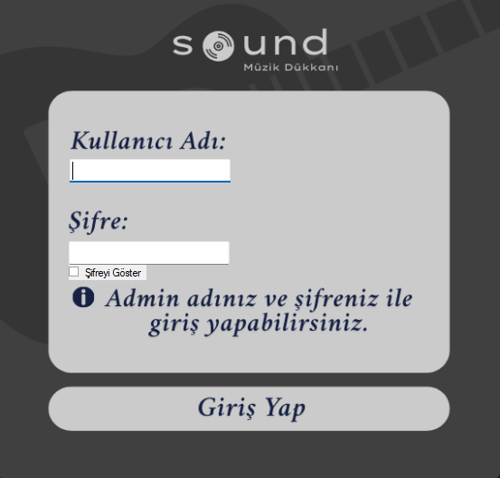
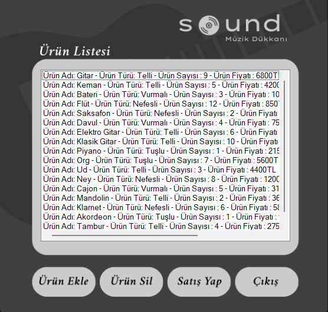

# 🎸 Müzik Dükkanının Yönetimi

Bu proje, **C# Windows Forms** kullanılarak geliştirilmiş bir **Müzik Dükkanının Yönetimi** uygulamasıdır. Kullanıcılar, müzik enstrümanlarını ekleyebilir, silebilir, güncelleyebilir ve enstrümanlar hakkında detaylı bilgi alabilir. Proje eğitim amaçlıdır.

## 🧩 Özellikler

- Enstrüman ekleme, silme ve güncelleme
- Enstrümanlar hakkında detaylı bilgi görüntüleme
- Kullanıcı dostu arayüz

## 🛠️ Kullanılan Teknolojiler

- C# (Windows Forms)
- .NET Framework
- Visual Studio
- (Opsiyonel: JSON, XML ya da SQL Server ile veri saklama)

## 🖼️ Uygulama İçi Ekran Görüntüleri

